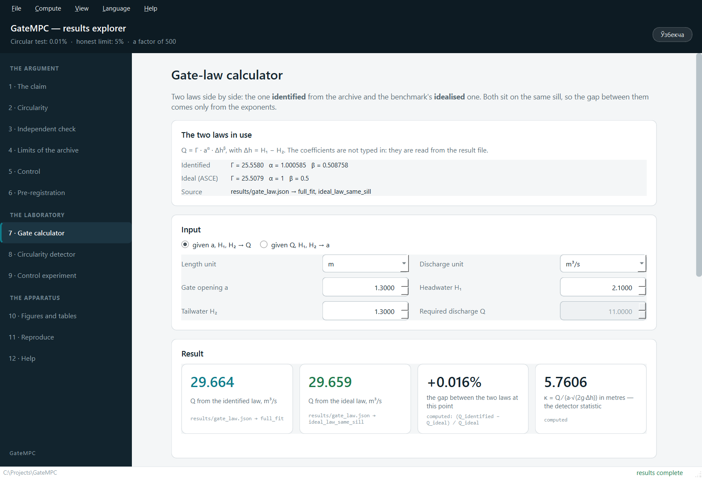

# GateMPC

**At a gated canal structure, the published continuous discharge is not a measurement.
It is the output of a rating equation — and checking a gate law against it is a
tautology.**

This repository contains the software, the normalised data package, the experiment
scripts and the tests behind that finding, plus a desktop application that shows the
results and applies the method to a structure of your own.

Everything here runs from a clone, on Windows, macOS and Linux.

---

## The finding in three numbers

| | |
|---|---|
| **0.01 %** | apparent misfit when a gate law is "validated" against the published discharge series — within a rating period, across ten deciles of relative opening spanning a factor of three thousand |
| **5 %** | the accuracy the U.S. Geological Survey itself states for its best-rated (`Good`) discharge measurements — the honest limit of what an independent measurement can resolve |
| **≈ 500×** | the gap between the two. A circular check reports a precision that does not exist |

The detector is datum-free and uses only published series:

```
kappa = Q / (a * sqrt(2 g * dh))
```

Under the ideal submerged-orifice law this equals `Cd * W_eff`, a constant. A kappa that
does not move is the signature of a discharge computed by that very formula.

The signature was confirmed at a second, independent structure where the rating takes a
*different* form: there kappa moves by 17 %, yet a fit of `log Q` on `log dh` and
`log a` still reproduces the discharge to a median 0.85 %, and that residual is
structured rather than scattered. So the general signature is two measurable
conditions — the discharge is reproduced far more tightly than field-measurement
accuracy allows, **and** what is left over is structured.

The way out is independent field gaugings. Checked against 77 of them, gaugings it was
never fitted to, the benchmark's idealised gate law has a median relative residual of
**+0.51 %**, and 76 of the 77 fall inside the measurement's own stated accuracy.

---

## Quick start

```bash
git clone <this repository>
cd GateMPC
python -m pip install -r requirements.txt

# 1. check the data package against its SHA-256 checksums (no network needed)
python scripts/download_usgs.py --verify

# 2. rebuild every published number
python scripts/archive_diagnostics.py
python scripts/identify_gate_law.py
python scripts/discharge_coefficient.py
python scripts/validate_gate_law.py
python scripts/second_structure.py
python scripts/model_error_envelope.py
python scripts/control_comparison.py
python scripts/make_figures.py
python scripts/make_tables.py

# 3. run the tests
python -m pytest -q
```

Python 3.11 or newer. Nothing above needs a network connection: the data package is in
the repository, and `download_usgs.py` only goes to the USGS API when a layer is
missing.

### The results explorer

```bash
python -m pip install -r requirements-gui.txt
python main.py
```



A desktop application with twelve pages in three sections.

**The argument** (pages 1–6) walks the same road the manuscript walks — the claim, the
circularity and its detector, the independent check, the limits of the archive, the
cost to a controller, and the pre-registration record. Every number on screen carries
the file and the key it was read from; none is typed in.

**The laboratory** (pages 7–9) takes your input:

* **Gate calculator** — enter an opening and two stages, read off the discharge under
  both laws, the gap between them and kappa; or enter a required discharge and read off
  the opening each law asks for. Outside the range the archive covers, the page says it
  is extrapolating.
* **Circularity detector** — run the study's method on a site-year from the data package
  or on your own CSV of readings (time, gate opening, two stages, discharge). The
  thresholds are on screen and editable, and the saved result carries whichever values
  were actually used.
* **Control experiment** — set the replicates, the pool length and the minimum gate
  step; the window runs `scripts/control_comparison.py` with those parameters and shows
  the result.

**The apparatus** (pages 10–12) holds every figure and table with its provenance, the
buttons that reproduce the lot, and the help.

Two rules the application holds itself to: it never shows a number without its source,
and nothing produced from a form is written into `results/` — that goes to
`build/lab/`, because a published number is what a script wrote with its registered
parameters.

PyQt6 is deliberately not in `requirements.txt`. Every number in the manuscript can be
recomputed without a GUI toolkit, and a reviewer on a headless machine should not be
asked to install one.

Command-line options:

```bash
python main.py --language en          # English; --language uz for Uzbek (Cyrillic)
python main.py --page prereg          # open on a page; --list-pages shows the keys
python main.py --screenshot page.png  # render one page to a file and exit
```

---

## What is in here

| | |
|---|---|
| `DATA/USGS_canal_gates_v1/` | the normalised USGS layers, a provenance file recording every source URL, access date, licence and query, and `SHA256SUMS` |
| `scripts/` | the ten scripts that produce every published number, figure and table |
| `src/gatempc/` | the library they share: the archive reader, the gate law, the canal and controllers, the USGS client, the circularity detector, and the explorer |
| `results/` | the result files the manuscript cites by name, plus the figures and tables built from them |
| `tests/` | the test suite |
| `main.py` | the results explorer |

`results/tables/table_A1_provenance.csv` lists, for every figure and table, the files it
was actually built from. That list is not maintained by hand: `make_figures.py` records
each file it opens while drawing, and Appendix A is derived from that record.

---

## Reproducibility

* **The data package is its own regression test.** `download_usgs.py --verify` checks
  every file against `SHA256SUMS` and makes no HTTP request. A full rebuild from the
  USGS API reproduces the package byte for byte.
* **Every script is deterministic.** Random draws are seeded and the seeds are recorded
  in the result files.
* **Parameters have registered defaults.** `second_structure.py` and
  `control_comparison.py` accept options so the method can be pointed at other data, but
  every default is the value fixed before the study's own measurement, and a run that
  departs from them says so in its own output. Write such a run somewhere other than
  `results/` with `--out`.
* **Timings belong to one machine.** `results/control_comparison.json` records the
  platform, processor and runtime of the machine the published numbers were measured on.
  A different machine will differ in the runtime and must agree in the numbers.

---

## Licence and citation

The **software** — everything under `src/`, `scripts/`, `tests/` and `main.py` — is
released under the MIT licence. See [`LICENSE`](LICENSE).

The **data package** under `DATA/` is released under
[CC0 1.0 Universal](DATA/LICENSE). The underlying observations are published by the U.S.
Geological Survey and are in the public domain in the United States; this repository
adds only normalisation and provenance, and places that work in the public domain too.

CC0 attaches no conditions. Separately from the licence, and as a request rather than a
requirement: if this work is useful to you, please cite the paper and this repository.
[`CITATION.cff`](CITATION.cff) has the details.

Release `v1.0.0` — commit `197dcf5`, the snapshot the paper was built from — is archived
at Zenodo under DOI [10.5281/zenodo.22549214](https://doi.org/10.5281/zenodo.22549214).
The concept DOI [10.5281/zenodo.22549213](https://doi.org/10.5281/zenodo.22549213)
resolves to the latest version, whichever that is.

---

## Platform support

The software is tested on Windows, macOS and Linux. Paths are built with `pathlib`
only; there is no drive letter and no absolute POSIX path anywhere in the source, and
two tests enforce that.

On a Linux machine with no desktop session, the explorer can still render a page:

```bash
QT_QPA_PLATFORM=offscreen python main.py --screenshot page.png
```

That variable is for Linux only. On Windows the offscreen plugin ships no fonts and
would render every character as an empty box; `--screenshot` there uses the native
plugin, which draws the window without putting it on the desktop.
